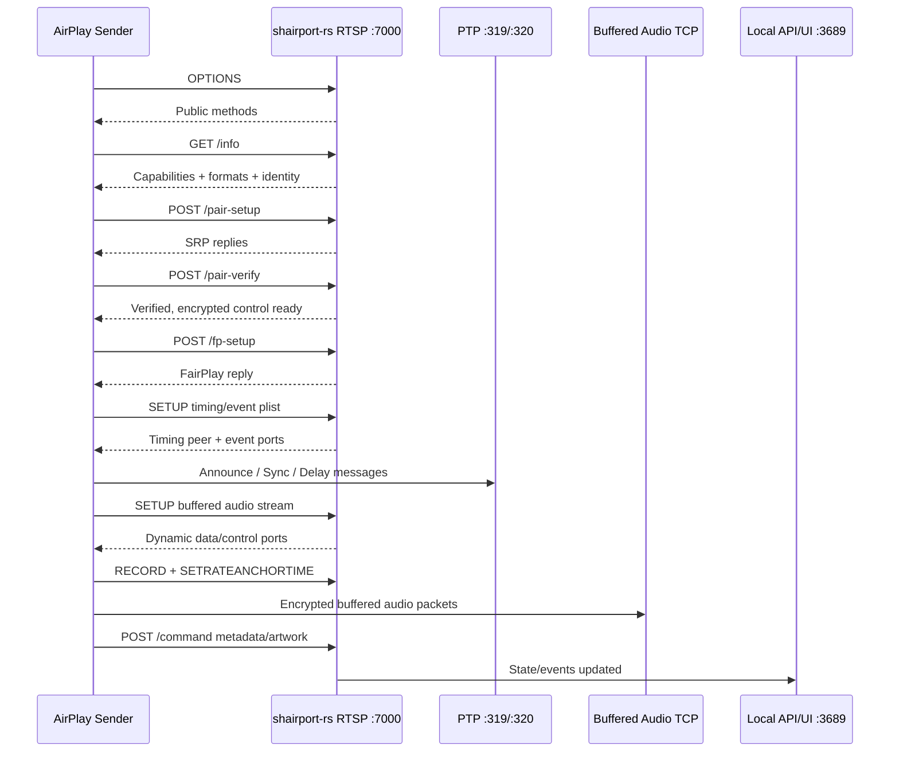
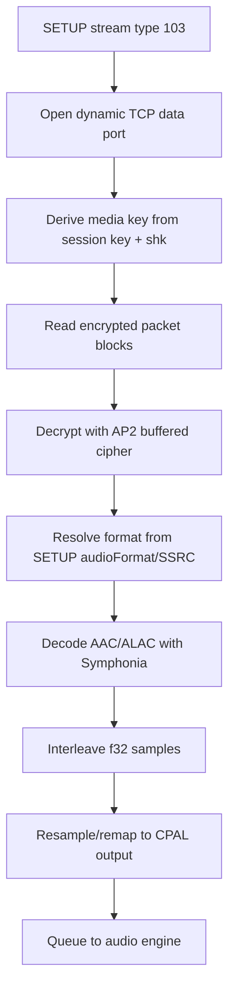
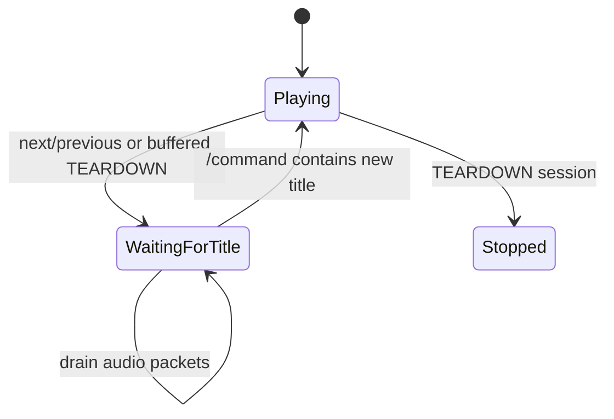

# shairport-rs

Rust-native AirPlay receiver workbench for Shairport Sync. The current focus is
AirPlay 2 audio, local media controls, CPAL output, PTP timing, and flexible
mDNS discovery.

## Run

```powershell
cargo run --manifest-path shairport-rs/Cargo.toml -- --config shairport-rs/shairport-rs.toml
```

The local API and web UI listen on `127.0.0.1:3689` by default.

## Discovery

`mdns.backend = "auto"` is the default. Auto mode uses the native mDNS publisher
when it is installed, then falls back to the built-in Rust publisher.

| Platform | Auto order |
| --- | --- |
| Linux | `avahi-publish-service`, `dns-sd`, built-in |
| macOS | `dns-sd`, `avahi-publish-service`, built-in |
| Windows | `dns-sd`, `avahi-publish-service`, built-in |
| Other | `dns-sd`, `avahi-publish-service`, built-in |

The built-in backend publishes `_raop._tcp.local.` and `_airplay._tcp.local.`
with automatic LAN address selection. On hosts with multiple adapters, set
`mdns.interface` to the interface that shares a network with the Apple sender.
On Windows, allow inbound UDP 5353 and TCP 7000 for the daemon.

```toml
[mdns]
backend = "auto"
service_name = "Shairport RS"
hostname = "shairport-rs"
```

Explicit backends are still available:

```toml
[mdns]
backend = "builtin"  # auto, builtin, dns-sd, avahi, external, off
```

For `backend = "external"`, set `external_command` to a command that accepts:

```text
<instance-name> <service-type> <port> <txt>...
```

## Audio

Audio output uses CPAL. `host = "default"` lets CPAL select the platform default
host, which is typically WASAPI on Windows, CoreAudio on macOS, and ALSA/Pulse or
the available CPAL default on Linux. The decoder emits interleaved `f32`, and
the audio engine resamples/remaps to the selected output device format.

```toml
[audio]
backend = "cpal"
host = "default" # default, wasapi, coreaudio, alsa, asio, jack
```

ASIO support is feature-gated:

```powershell
cargo build --manifest-path shairport-rs/Cargo.toml --features asio
```

## Local HTTP API

The API is intended for the bundled web UI and local automation.

| Method | Path | Purpose |
| --- | --- | --- |
| `GET` | `/` | Web UI |
| `GET` | `/api/v1/state` | Full receiver state snapshot |
| `GET` | `/api/v1/media` | Now-playing, progress, volume, playback, artwork URL |
| `POST` | `/api/v1/media/control` | JSON media control command |
| `GET` | `/api/v1/artwork` | Current artwork bytes, when available |
| `GET` | `/api/v1/audio/devices` | CPAL output device list |
| `GET` | `/api/v1/audio/status` | Selected output device and format |
| `POST` | `/api/v1/audio/device` | Select output device |
| `GET` | `/api/v1/mdns/status` | Active mDNS backend, services, errors |
| `POST` | `/api/v1/volume` | Set receiver volume |
| `POST` | `/api/v1/session/drop` | Drop the active AirPlay session |
| `POST` | `/api/v1/remote/{command}` | Send playback/navigation command |
| `GET` | `/api/v1/events` | Server-sent state events |

Control commands:

| Command | Behavior |
| --- | --- |
| `next`, `nextitem` | Sends DACP `nextitem` to the sender |
| `previous`, `prev`, `previtem` | Sends DACP `previtem` to the sender |
| `playpause`, `toggle` | Sends DACP `playpause` when a DACP session exists |
| `play` | Enables local playback and sends DACP when available |
| `pause` | Pauses local playback and sends DACP when available |
| `stop` | Stops local playback and sends DACP when available |
| `volume` | Sets local receiver gain |

Example:

```powershell
Invoke-RestMethod http://127.0.0.1:3689/api/v1/media
Invoke-RestMethod -Method Post http://127.0.0.1:3689/api/v1/media/control `
  -ContentType application/json `
  -Body '{"command":"next"}'
```

## AirPlay 2 RTSP/API Surface

The receiver advertises AirPlay 2 over `_airplay._tcp.local.` and RAOP over
`_raop._tcp.local.`. AP2 control uses RTSP over TCP on `airplay.bind`
(`0.0.0.0:7000` by default). Binary bodies are Apple binary plists unless noted.

| Request | Purpose |
| --- | --- |
| `OPTIONS *` | Returns supported RTSP methods |
| `GET /info` | Returns receiver capabilities, TXT mirror data, identity public key, supported formats |
| `POST /pair-setup` | SRP pairing setup and control cipher activation |
| `POST /pair-pin-start` | Starts PIN pairing flow |
| `POST /pair-add` | Adds pairing material |
| `POST /pair-remove` | Removes pairing material |
| `POST /pair-list` | Lists pairing material |
| `POST /pair-verify` | Verifies paired sender and activates control/event ciphers |
| `POST /fp-setup` | FairPlay setup response |
| `SETUP` initial plist | Negotiates AP2 timing/event setup |
| `SETUP` streams plist | Opens realtime audio, buffered audio, or data/event stream ports |
| `RECORD` | Starts the negotiated audio timeline |
| `SETRATEANCHORTIME` | Applies AP2 rate and RTP/network-time anchor |
| `POST /command` | Now-playing metadata, artwork, supported commands, remote commands |
| `POST /feedback` | Sender feedback/status endpoint |
| `POST /audioMode` | Records AP2 audio mode diagnostics |
| `POST /configure` | Acknowledged configuration endpoint |
| `SETPEERS`, `SETPEERSX` | Records peer/group diagnostics |
| `FLUSHBUFFERED` | Flushes buffered stream ranges and local queue |
| `TEARDOWN` stream plist | Tears down one AP2 stream |
| `TEARDOWN` session | Stops playback and clears session keys |

### Handshake



### Buffered Audio Flow



### Media Change Guard

When the sender tears down a buffered stream or the receiver sends a navigation
command, the receiver flushes queued audio, clears the current track, resets AP2
format hints, and waits for fresh title metadata before enabling playback. This
prevents old stream packets from playing briefly after next/previous.



## DACP Source Controls

Next/previous are source controls. The receiver has no playlist authority, so it
sends DACP HTTP requests back to the sender when `dacpID` and `activeRemote` are
available.

```text
GET /ctrl-int/1/nextitem HTTP/1.1
Host: <sender-host>:<dacp-port>
Active-Remote: <activeRemote>
```

The DACP service is discovered via `_dacp._tcp.local.` and cached per active
sender/session. If session data is missing, navigation commands return a clear
remote-control unavailable error instead of pretending success.

## Logging

Default logs keep high-volume timing traffic quiet. PTP announce packets and AP2
`/feedback` pings are debug-level logs.
